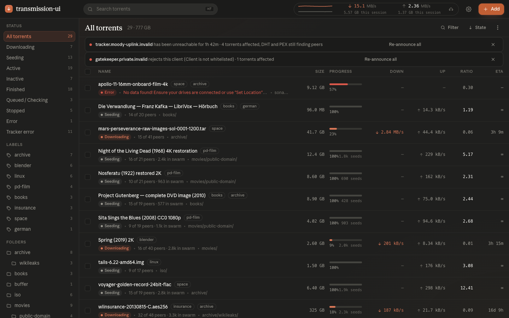
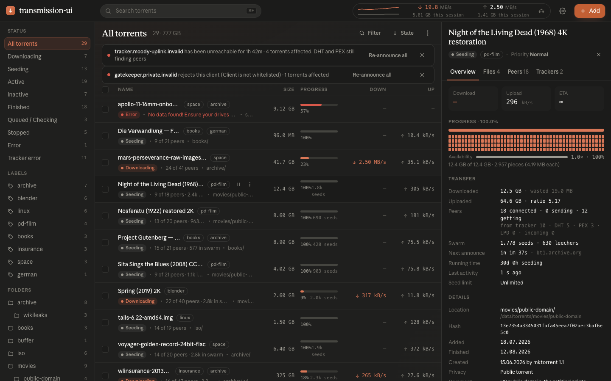

# transmission-ui

A web client for transmission-daemon: a static bundle the daemon serves itself, in place of its
built-in web UI. React 19 + TypeScript, no runtime dependencies beyond the daemon's RPC.



Selecting a torrent opens an inspector with progress, pieces, transfer numbers, files, peers and
per-tracker announce state.



## Requirements

transmission-daemon **4.1.x**. The UI speaks JSON-RPC 2.0 with snake_case keys (`rpc_version` 18+)
and does not talk to the 4.0.x protocol.

## Install

Two ways in, both from the release:

**Container image** — transmission-daemon with the UI baked in:

```
ghcr.io/trick77/transmission-ui:latest
```

`compose.yaml` in this repo is a working stack: the UI behind an external Traefik, RPC still on
`:9091` for radarr/sonarr and `transmission-remote`. Copy `.env.example` to `.env` first.

**Bundle only** — mount it into a daemon you already run:

1. Download `transmission-ui-<version>.zip` from the [releases](https://github.com/trick77/transmission-ui/releases) and unzip it somewhere the daemon can read.
2. Mount it at `/web` and set `TRANSMISSION_WEB_HOME=/web`.
3. Restart the daemon. Unsetting the variable puts the stock UI back.

## Development

```
docker compose -f compose.dev.yaml up -d   # throwaway daemon on :9091, dev/devpass
hack/fixtures.sh                           # seed every torrent state the UI shows
cd ui && npm ci && npm run dev             # http://localhost:5173
```

`make sim` runs the UI against `ui/sim/`, an in-process fake daemon, when you don't want a
container. The screenshots above come from it, so the torrents in them are made up.

See `AGENTS.md` for layout, test gates and conventions.

## Licence

MIT. See `LICENSE`.
