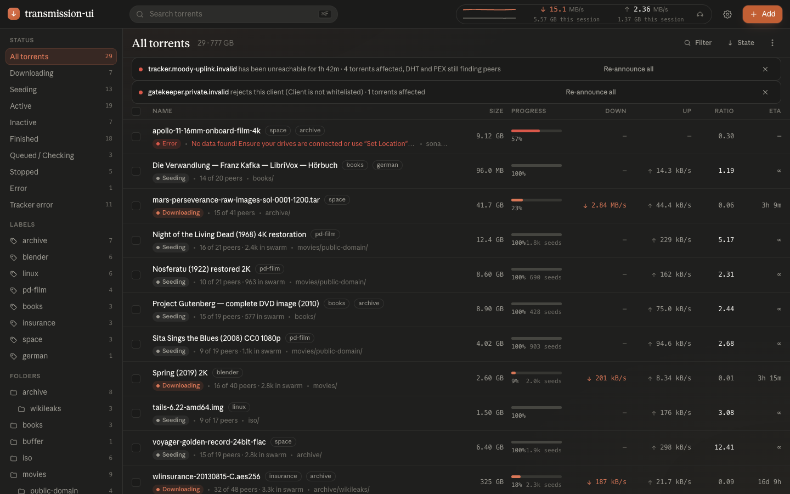
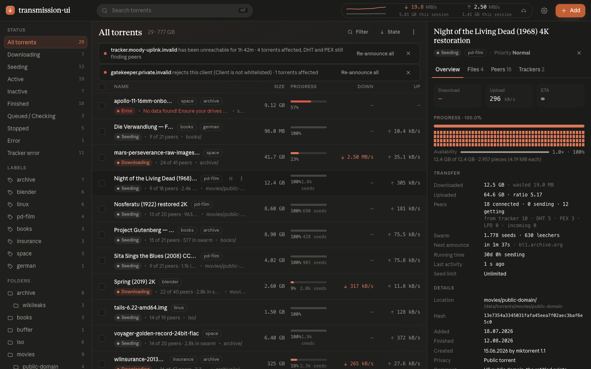

# transmission-ui

A web client for transmission-daemon, with a backend that signs users in and keeps the daemon's
credentials off the browser. React 19 + TypeScript, Go, no database.



Selecting a torrent opens an inspector with progress, pieces, transfer numbers, files, peers and
per-tracker announce state.



## Requirements

transmission-daemon **4.1.x**. The UI speaks JSON-RPC 2.0 with snake_case keys (`rpc_version` 18+)
and does not talk to the 4.0.x protocol.

## How it works

`ghcr.io/trick77/transmission-ui` is the UI bundle embedded in a Go binary. The binary serves the
bundle, terminates the login, and reverse-proxies `/transmission/rpc` to your daemon with the
daemon's basic auth attached. The browser never sees those credentials, and an unauthenticated RPC
call gets a 401 rather than a native auth dialog.

The image contains **no daemon**. Point `TM_RPC_UPSTREAM` at one; it keeps its own RPC port for
`transmission-remote` and the *arr apps, which go on using basic auth directly.

## Install

```
cp .env.example .env     # fill in TM_*, the auth block, and the session secret
docker compose up -d
```

That starts the app, but it is not reachable yet: `compose.yaml` publishes no port. Putting a
reverse proxy in front is the part you do on your own setup.

### Reverse proxy (required, and yours to set up)

The app must run behind a reverse proxy that terminates TLS. This repo does not ship one and does
not configure yours: add it to your own stack. Without it the app does not start, because
`BACKEND_PUBLIC_URL` has to be an `https://` URL (plain http is accepted for a loopback address
only, which is what local development uses).

What you need to do on your side:

1. **Connect the proxy to the container.** Attach the `transmission-ui` service to a Docker network
   your proxy is on and route to port `8080`. If the proxy runs on the host instead, add a `ports:`
   mapping bound to loopback, e.g. `127.0.0.1:8080:8080`.
2. **Terminate TLS** at the proxy and set `BACKEND_PUBLIC_URL` to the resulting `https://` URL.
3. **Pass the `Host` header through unchanged.** The app refuses cross-origin POSTs. Current
   browsers state the origin relation themselves (`Sec-Fetch-Site`); for the others the app
   compares `Origin` with `Host`, and a rewritten `Host` then fails sign-in and every RPC call
   with 403. Traefik and Caddy pass it by default; nginx needs `proxy_set_header Host $host;`.
4. **Set `X-Forwarded-For`.** Form login throttles per client and reads the last entry. Without it
   every visitor shares the proxy's address and one mistyped password slows everyone down.
5. **Forward a path prefix, do not strip it**, if you serve the app under one (see below).
6. **Turn on compression.** The app serves its bundle uncompressed (about 320 kB of JavaScript,
   under 100 kB gzipped) and leaves that to the proxy.

With Traefik, for example, that is the proxy's network on the service plus these labels:

```yaml
    networks: [traefik]
    labels:
      traefik.enable: "true"
      traefik.http.routers.transmission-ui.rule: Host(`transmission.example.com`)
      traefik.http.routers.transmission-ui.entrypoints: websecure
      traefik.http.routers.transmission-ui.tls: "true"
      traefik.http.routers.transmission-ui.middlewares: transmission-ui-compress
      traefik.http.middlewares.transmission-ui-compress.compress: "true"
      traefik.http.services.transmission-ui.loadbalancer.server.port: "8080"
```

Keep such settings in your own compose file or an override, not in a copy of this repo's
`compose.yaml`: that file is a starting point and changes with releases.

### Signing in

`BACKEND_AUTH_MODE` picks one:

- **`form`** — a login page that accepts the daemon's own RPC credentials (`TM_USER` / `TM_PASS`).
  Nothing extra to provision, and what local development uses.
- **`oidc`** — an identity provider. Register a confidential client with redirect URI
  `<BACKEND_PUBLIC_URL>/api/auth/callback`, request the `groups` scope, and optionally gate access
  on `BACKEND_OIDC_ALLOWED_GROUP`.

Logout clears the local session; it does not end the session at the identity provider.

### Behind a path prefix

Set `BACKEND_PUBLIC_URL` to the full external URL, including any path:

```
BACKEND_PUBLIC_URL=https://seedbox.example.com/transmission
```

Every route then mounts under that prefix. The reverse proxy must forward it, not strip it.

### Bundle only

The release also ships `transmission-ui-<version>.zip`: unzip it, mount it at `/web`, set
`TRANSMISSION_WEB_HOME=/web`, restart the daemon. Unsetting the variable puts the stock UI back.
This path has no backend, so the daemon's own basic auth applies and there is no OIDC.

## Development

```
docker compose -f compose.dev.yaml up -d   # throwaway daemon on :9091, dev/devpass
scripts/fixtures.sh                           # seed every torrent state the UI shows
cd ui && npm ci && npm run dev             # http://localhost:5173
```

`scripts/backend.sh` builds and runs the real backend against that daemon in form mode, which is what
`ui/e2e/backend.spec.ts` drives. `make sim` runs the UI against `ui/sim/`, an in-process fake
daemon, when you don't want a container — the screenshots above come from it, so the torrents in
them are made up.

See `AGENTS.md` for layout, test gates and conventions.

## Licence

MIT. See `LICENSE`.
